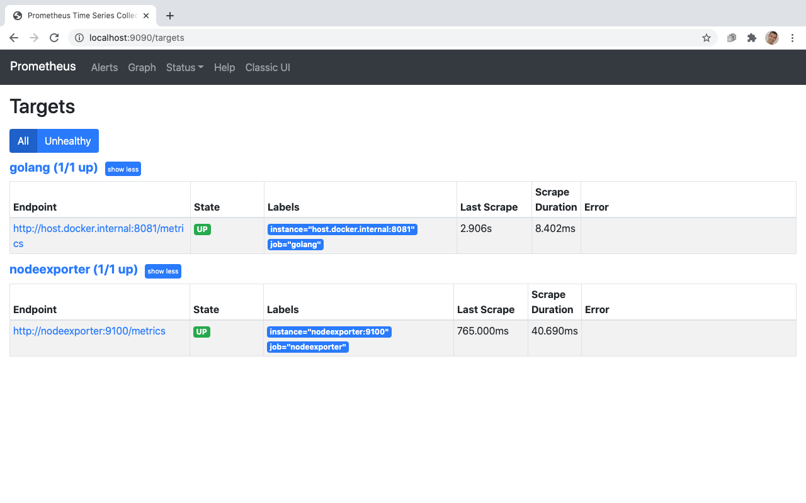

# Hello!

This is a SRE test, but it is also an example of a monitoring stack tools with an application running.

What you will find here:
-A `Golang Application`: An application that has two endpoints, each endpoint has a strategy for generating a random number.
-This application provides performance metrics for each endpoint, so you can compare the two strategies using the data provided

-An Event and Alert monitoring tool called `Prometheus`: This tool receives metrics and allow us to process and query this metrics, generating data to better understanding what happening with our application.  

-A dashboard tool called `Grafana`: With Grafana we can representing in a visual way the data provided by Prometheus.

You also can check my journey here:

## sre-test-1

### Documentação do Projeto

- [pt-br](docs/pt-br/README.md)

### Documentação do Resultado

- [pt-br](docs/pt-br/RESULT.md)


# Install

After you have installed [docker-compose](https://docs.docker.com/compose/gettingstarted/), we can get start:

```shell
docker-compose up -d
```

# Prometheus

## Prometheus (metrics database) http://localhost:9090



# Grafana
## Grafana (visualize metrics) http://localhost:3000 (Login: `admin` - Password `admin`)


# Application
## Metrics http://localhost:8081/metrics


## GetRandomNumber http://localhost:8080/get-random-number


## GetRandomNumber Native http://localhost:8080/get-random-number-native


# Contributing

## PRs accepted.

### TODO: Less time in Github actions:
> https://github.com/actions/cache/
> https://developer.github.com/v3/actions/workflows/
> https://dev.to/dtinth/series/6349
> https://dev.to/dtinth/caching-docker-builds-in-github-actions-which-approach-is-the-fastest-a-research-18ei/

# License

[MIT © Guilherme Sette](LICENCE)