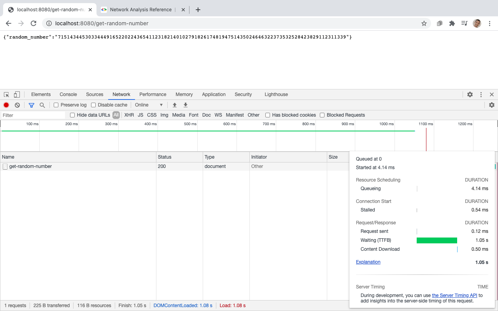
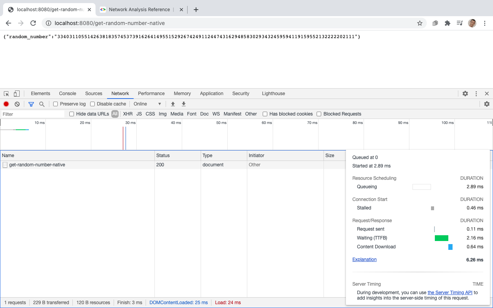
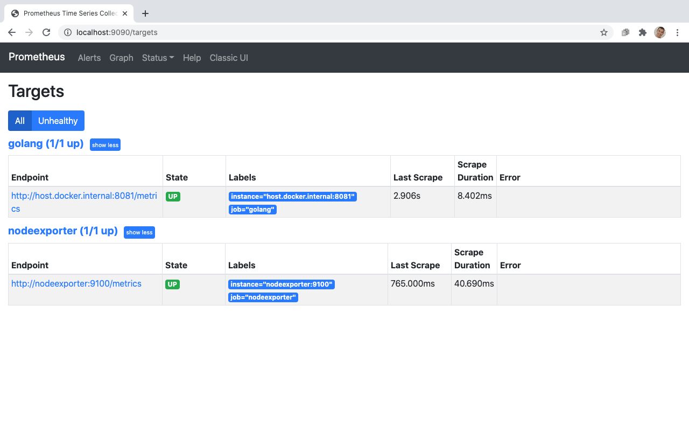
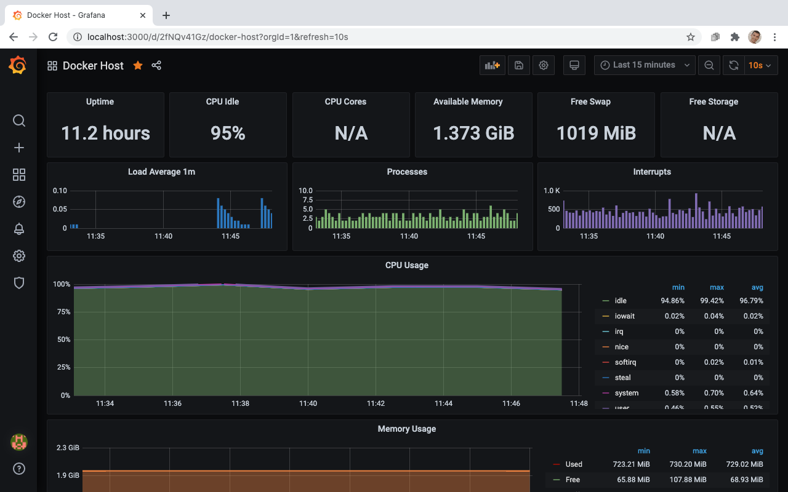
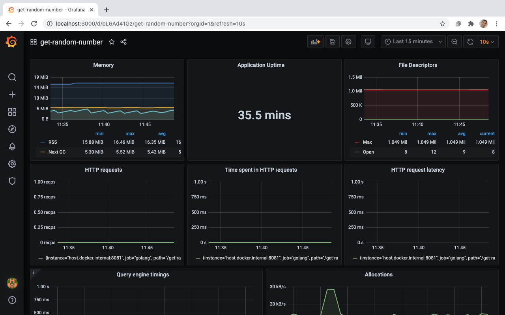
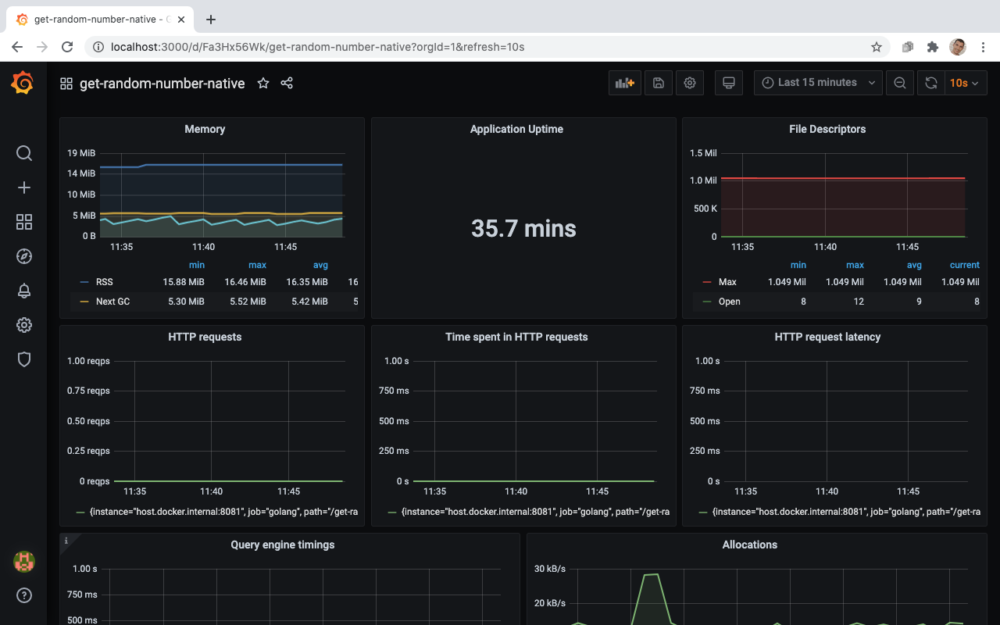
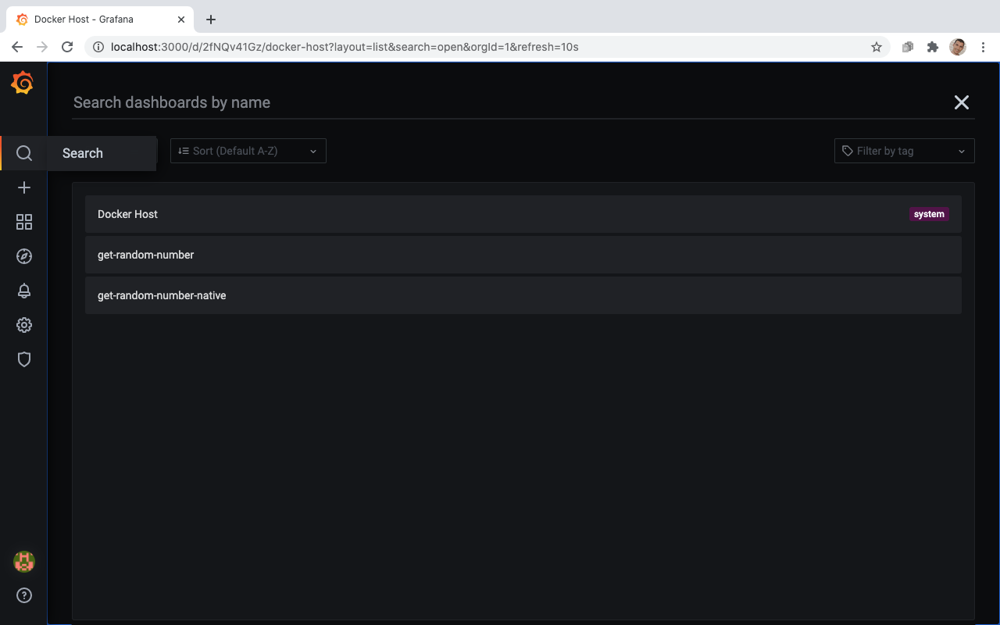

# Olá

Você pode encontrar abaixo a documentação deste teste, conforme as atividaes solicitadas.
> Além do que foi proposto, eventualmente haverão também alguns comentários sobre esta jornada.

## Para configurar seu repositório

- [x] Realize a substituição de todas as strings `testing/sre-test-1` por `SEU_USUARIO_GIT/NOME_DO_SEU_REPOSITÓRIO` criando um script para fazer essa tarefa (na linguagem de sua escolha) em todos os arquivos.
- [x] Faça o commit e push da alteração para seu repositório.

> Foi criado um script em ShellScript ([replace.sh](../../replace.sh)) e realizado o commit e push das alterações, já com os arquivos alterados. Mais detalhes sobre esse script, pode ser encontrado no arquivo.

```sh
$ ./replace.sh numeroSette/SRE-TEST-7
Files replaced:
./cmd/get-random-number/register/register.go:   getrandomnumber "github.com/numeroSette/SRE-TEST-7/cmd/get-random-number"
./cmd/get-random-number/register/register.go:   "github.com/numeroSette/SRE-TEST-7/internal/router"
./cmd/main.go:  _ "github.com/numeroSette/SRE-TEST-7/cmd/get-random-number/register"
./cmd/main.go:  "github.com/numeroSette/SRE-TEST-7/internal/config"
./cmd/main.go:  "github.com/numeroSette/SRE-TEST-7/internal/router"
./go.mod:module github.com/numeroSette/SRE-TEST-7
```

## To fix

- [x] Aplicação não está realizando build da imagem Docker via pipeline no GitHub Actions.

> Corrigida a url `docker.pkg.gitbuh.com` por `docker.pkg.github.com` no arquivo [main.yml](../../.github/workflows/main.yml):

```yaml
    - name: Push image
    run: |
        IMAGE_ID=docker.pkg.github.com/${{ github.repository }}/$IMAGE_NAME
```

- [x] Não temos logs no pipeline ou alertas indicando sucesso do teste funcional.

> Substituído o parâmetro `-s` por `-v` no teste feito para validar a resposta do teste funcional, dessa maneira é possível ter uma resposta detalhada sobre o retorno da chamada ao endpoint:

> Alterações foram realizadas no arquivo [main.yml](../../.github/workflows/main.yml):

```yaml
      - name: Test URL response (/get-random-number)
        run: curl -v http://localhost:8080/get-random-number
```

```sh
$ curl -v http://localhost:8080/get-random-number
*   Trying ::1...
* TCP_NODELAY set
* Connected to localhost (::1) port 8080 (#0)
> GET /get-random-number HTTP/1.1
> Host: localhost:8080
> User-Agent: curl/7.64.1
> Accept: */*
> 
< HTTP/1.1 200 OK
< Content-Type: application/json
< Date: Sun, 06 Dec 2020 05:54:44 GMT
< Content-Length: 116
< 
{"random_number":"17722303992115235272844924504241253148611320514081232194338332455231136341816473746263514294410"}
* Connection #0 to host localhost left intact
* Closing connection 0
```

> Foi também adicionado o parâmetro `-f` que retorna um código 22 para a maioria das tentativas de chamadas mal-sucedidas, é interessante observar que esse método não é totalmente seguro, porém para atender o cenário atual sem agregar complexidade foi utilizada essa estratégia

```text
-f, --fail

(HTTP) Fail silently (no output at all) on server errors. 

This is mostly done to better enable scripts etc to better deal with failed attempts. 

In normal cases when an HTTP server fails to deliver a document, 
it returns an HTML document stating so (which often also describes why and more). 

This flag will prevent curl from outputting that and return error 22.

This method is not fail-safe and there are occasions where non-successful response codes will slip through, especially when authentication is involved (response codes 401 and 407).
```

> Dessa maneira quando for chamada, a pipeline pode entender que esse retorno trata-se de um erro e falhar no step. Também é possível criar uma condição customizada para aceitar apenas alguns tipos de retornos, porém os mesmos devem previstos.

> Alterações foram realizadas no arquivo [main.yml](../../.github/workflows/main.yml):

```yaml
      - name: Test URL response (/get-random-number)
        run: curl -fv http://localhost:8080/get-random-number
```

```sh
$ curl -fv http://localhost:8080/get-random-number
*   Trying ::1...
* TCP_NODELAY set
* Connected to localhost (::1) port 8080 (#0)
> GET /get-random-number HTTP/1.1
> Host: localhost:8080
> User-Agent: curl/7.64.1
> Accept: */*
> 
* The requested URL returned error: 404 Not Found
* Closing connection 0
curl: (22) The requested URL returned error: 404 Not Found
```

- [x] Existe um step no pipeline em que realizamos um teste funcional realizando o request para http://localhost:8080/random-number e validamos a resposta, verificar se o teste feito aqui realmente garante que o endpoint está respondendo devidamente.

> Alterada rota `/random-number` por `/get-random-number` no arquivo no arquivo [register.go](../../cmd/get-random-number/register/register.go):

```golang
func init() {
    router.Router.HandleFunc("/get-random-number", getrandomnumber.GetRandomNumber)
}
```

> Esta rota não correspondia ao que estava configurado na pipeline, conforme pode ser visto no arquivo [main.yml](../../.github/workflows/main.yml):

```yaml
      - name: Test URL response (/get-random-number)
        run: curl -fv http://localhost:8080/get-random-number
```

- [x] Criar o mesmo teste funcional para a rota `/metrics` da porta **9090**.

> Adicionada a configuração para a exposição de portas (host port e container port) `-p 9090:9090` no arquivo [main.yml](../../.github/workflows/main.yml), esta configuração estava faltando para que o endpoint `/metrics` pudesse ser alcançado

```yaml
      - name: Run service
        run: |
          docker run --rm \
            --name service \
            -d \
            -p 8080:8080 \
            -p 9090:9090 \            
            docker.pkg.github.com/${{ steps.docker_config.outputs.image_repository }}/service:latest
```

> Foi adicionado também no [main.yml](../../.github/workflows/main.yml), o mesmo teste de endpoint que utilizamos anteriormente para `get-random-number`

```yaml
      - name: Test URL response (/metrics)
        run: curl -fv http://localhost:9090/metrics
```

## To do

- [x] Realizar testes de performance na geração de números randômicos.
- [x] Trazer relatórios sobre estatísticas e métricas dos testes de performance.
- [x] Diminuir tempo de geração de número randômico.

> Inicialmente foram realizados dois testes de performance, o primeiro foi realizado através do navegador, conforme pode-se verificar através da imagem abaixo:


> O segundo teste foi realizado por meio da criação de um teste de benchmark que pode ser encontrado no arquivo [function_test.go](../../cmd/get-random-number/function_test.go):

```sh
$ docker exec -i service bash -c "cd cmd/get-random-number && go test -run=Bench -bench=."
goos: linux
goarch: amd64
pkg: github.com/numeroSette/SRE-TEST-7/cmd/get-random-number
BenchmarkGetRandomNumberTest-2                 1        1442997725 ns/op
PASS
ok      github.com/numeroSette/SRE-TEST-7/cmd/get-random-number 1.452s
```
> Foi criado também um endpoint chamado `get-random-number-native`, este endpoint foi criado para que possa haver uma comparação entre a geração dos numeros randômicos, dessa maneira em vez de alterar o anterior foi somado um novo.
> Os arquivos referentes a este novo endpoint podem ser encontrados [neste caminho](../../cmd/get-random-number-native):

```golang
package getrandomnumbernative

import (
  "encoding/json"
  "fmt"
  "log"
  "math/rand"
  "net/http"
  "strings"
  "time"
)

// randomInt returns a string with random numbers
func randomInt() string {

  // Reference
  // https://flaviocopes.com/go-random/
  // https://www.random.org/sequences/?min=1&max=52&col=1&format=plain&rnd=new

  // Use Unix date to seed
  rand.Seed(time.Now().UnixNano())

  // Generate 52 numbers between 1 and 60
  var array = make([]int, 52)

  for i := 0; i < 52; i++ {
    array[i] = 1 + rand.Intn(60-1)
  }

  return strings.Trim(strings.Join(strings.Fields(fmt.Sprint(array)), ""), "[]")
}

// RandomNumberResponse is a struct for response
type RandomNumberResponse struct {
  RandomNumber string `json:"random_number"`
}

// GetRandomNumberNative is a function to return a random number
func GetRandomNumberNative(response http.ResponseWriter, request *http.Request) {

  out := &RandomNumberResponse{
    RandomNumber: randomInt(),
  }

  response.Header().Set("Content-Type", "application/json")

  err := json.NewEncoder(response).Encode(out)
  if err != nil {
    log.Printf("failed to encode json to HTTP response: %v", err)
  }

}

```

> Foi utilizada a mesma estrutura que `get-random-number` para a chamada deste novo endpoint (`get-random-number-native`), assim foi possível realizar os testes de forma igual e comparar apenas a maneira em que o número randômico é gerado nas duas abordagens:

```golang
package getrandomnumbernative

import (
  "net/http"
  "net/http/httptest"
  "regexp"
  "testing"
)

func GetRandomNumberNativeTest(b *testing.B) {

  // References
  // https://blog.questionable.services/article/testing-http-handlers-go/

  // Create a request to pass to our handler. We don't have any query parameters for now, so we'll
  // pass 'nil' as the third parameter.
  req, err := http.NewRequest("GET", "/get-random-number-native", nil)
  if err != nil {
    b.Fatal(err)
  }

  // We create a ResponseRecorder (which satisfies http.ResponseWriter) to record the response.
  rr := httptest.NewRecorder()
  handler := http.HandlerFunc(GetRandomNumberNative)

  // Our handlers satisfy http.Handler, so we can call their ServeHTTP method
  // directly and pass in our Request and ResponseRecorder.
  handler.ServeHTTP(rr, req)

  // Check the status code is what we expect.
  if status := rr.Code; status != http.StatusOK {
    b.Errorf("handler returned wrong status code: got %v want %v",
      status, http.StatusOK)
  }

  // Check the response body is what we expect.
  expected := `^\{\"random_number"\:\"\d+\"\}$`
  matched, _ := regexp.MatchString(`^\{\"random_number"\:\"\d+\"\}$`, rr.Body.String())
  if matched {
    b.Errorf("handler returned unexpected body: got %v want %v",
      rr.Body.String(), expected)
  }
}

func BenchmarkGetRandomNumberNativeTest(b *testing.B) { GetRandomNumberNativeTest(b) }

```

> O Resultados do teste com o novo endpoint podem ser verificados abaixo:


```sh
$ docker exec -i service bash -c "cd cmd/get-random-number-native && go test -run=Bench -bench=."
goos: linux
goarch: amd64
pkg: github.com/numeroSette/SRE-TEST-7/cmd/get-random-number-native
BenchmarkGetRandomNumberNativeTest-2    1000000000               0.000058 ns/op
PASS
ok      github.com/numeroSette/SRE-TEST-7/cmd/get-random-number-native  0.020s
```

> Os testes de benchmarking também estão sendo realizados na pipeline ([main.yml](../../.github/workflows/main.yml))

```yaml
      - name: Benchmark method GetRandomNumber (/get-random-number)
        run: docker exec -i service bash -c "cd cmd/get-random-number && go test -run=Bench -bench=."

      - name: Benchmark method GetRandomNumberNative (/get-random-number-native)
        run: docker exec -i service bash -c "cd cmd/get-random-number-native && go test -run=Bench -bench=."
```


- [x] Criar documentação para outros colaboradores contribuírem com o projeto.
> Este arquivo descreve como foi a minha jornada de uma pessoa SRE (eu gostei muito dessa parte :-D )
> Mas no [README.md](../../internal/router/router.go)), tem a documentação de como funciona esse projeto e como você pode contribuir!
> Eu utilizei esse modelo pra escrever o README: https://github.com/RichardLitt/standard-readme

- [x] Implementar métricas sobre o serviço http que responde na rota `/get-random-number` (dicas https://www.robustperception.io/prometheus-middleware-for-gorilla-mux e para uma implementação mais simples, utilize o arquivo [router.go](../../internal/router/router.go)) expondo através da rota `/metrics` as métricas adicionais.

> Foi adicionado no arquivo ([main.go](../../cmd/main.go)) a linha `router.Router.Use(router.PrometheusMiddleware)` para que sejam expostas as métricas de todas as rotas.

```golang
  config.Register().Load()

  router.Router.Use(router.PrometheusMiddleware)

  serviceServer := http.NewServeMux()
  serviceServer.Handle("/", router.Router)
```

> No arquivo ([router.go](../../internal/router/router.go)), foi adicionada a implementação de `PrometheusMiddleware`:

```golang
package router

import (
  "net/http"

  "github.com/gorilla/mux"
  "github.com/prometheus/client_golang/prometheus"
  "github.com/prometheus/client_golang/prometheus/promauto"
)

// Router implements mux.NewRouterFunc.
var Router = mux.NewRouter()

var (
  httpDuration = promauto.NewHistogramVec(prometheus.HistogramOpts{
    Name: "sre_test_7_http_duration_seconds",
    Help: "Duration of HTTP requests.",
  }, []string{"path"})
)

// PrometheusMiddleware implements mux.MiddlewareFunc.
func PrometheusMiddleware(next http.Handler) http.Handler {
  return http.HandlerFunc(func(w http.ResponseWriter, r *http.Request) {
    route := mux.CurrentRoute(r)
    path, _ := route.GetPathTemplate()
    timer := prometheus.NewTimer(httpDuration.WithLabelValues(path))
    next.ServeHTTP(w, r)
    timer.ObserveDuration()
  })
}
```

> Dessa maneira todas as métricas expostas através dos endpoints terão como prefixo `sre_test_7_http_duration_seconds`, conforme pode ser visto no output da rota `/metrics`:

```text
sre_test_7_http_duration_seconds_bucket{path="/get-random-number",le="0.005"} 0
sre_test_7_http_duration_seconds_bucket{path="/get-random-number",le="0.01"} 0
sre_test_7_http_duration_seconds_bucket{path="/get-random-number",le="0.025"} 0
sre_test_7_http_duration_seconds_bucket{path="/get-random-number",le="0.05"} 0
sre_test_7_http_duration_seconds_bucket{path="/get-random-number",le="0.1"} 0
sre_test_7_http_duration_seconds_bucket{path="/get-random-number",le="0.25"} 0
sre_test_7_http_duration_seconds_bucket{path="/get-random-number",le="0.5"} 0
sre_test_7_http_duration_seconds_bucket{path="/get-random-number",le="1"} 0
sre_test_7_http_duration_seconds_bucket{path="/get-random-number",le="2.5"} 1
sre_test_7_http_duration_seconds_bucket{path="/get-random-number",le="5"} 1
sre_test_7_http_duration_seconds_bucket{path="/get-random-number",le="10"} 1
sre_test_7_http_duration_seconds_bucket{path="/get-random-number",le="+Inf"} 1
sre_test_7_http_duration_seconds_sum{path="/get-random-number"} 1.568436347
sre_test_7_http_duration_seconds_count{path="/get-random-number"} 1
sre_test_7_http_duration_seconds_bucket{path="/get-random-number-native",le="0.005"} 1
sre_test_7_http_duration_seconds_bucket{path="/get-random-number-native",le="0.01"} 1
sre_test_7_http_duration_seconds_bucket{path="/get-random-number-native",le="0.025"} 1
sre_test_7_http_duration_seconds_bucket{path="/get-random-number-native",le="0.05"} 1
sre_test_7_http_duration_seconds_bucket{path="/get-random-number-native",le="0.1"} 1
sre_test_7_http_duration_seconds_bucket{path="/get-random-number-native",le="0.25"} 1
sre_test_7_http_duration_seconds_bucket{path="/get-random-number-native",le="0.5"} 1
sre_test_7_http_duration_seconds_bucket{path="/get-random-number-native",le="1"} 1
sre_test_7_http_duration_seconds_bucket{path="/get-random-number-native",le="2.5"} 1
sre_test_7_http_duration_seconds_bucket{path="/get-random-number-native",le="5"} 1
sre_test_7_http_duration_seconds_bucket{path="/get-random-number-native",le="10"} 1
sre_test_7_http_duration_seconds_bucket{path="/get-random-number-native",le="+Inf"} 1
sre_test_7_http_duration_seconds_sum{path="/get-random-number-native"} 0.000196257
sre_test_7_http_duration_seconds_count{path="/get-random-number-native"} 1
```

> Para ter uma visão melhor a respeito dos relatórios dessa aplicação criamos o arquivo ([docker-compose.yml](../../docker-compose.yml)), nele foi adicionada a build da `Aplicação` e também o `Prometheus`, `Grafana` e `node-exporter`:

```yml
version: '3.5'
networks:
  monitor-net:
    driver: bridge
volumes:
    prometheus_data: {}
    grafana_data: {}

services:

  #--------------------------------------------------------------------------#
  # SERVICES DEFINITIONS
  #--------------------------------------------------------------------------#

  application:
    build:
      context: .
      dockerfile: ./Dockerfile
    ports:
      - "8080:8080"
      - "8081:8081"      
    environment:
      DOCKER_COMPOSE: "true"
    restart: always
    networks:
      - monitor-net
    labels:
      org.label-schema.group: "application"

  #--------------------------------------------------------------------------#
  # PROMETHEUS DEFINITIONS
  #--------------------------------------------------------------------------#
  prometheus:
    image: prom/prometheus:v2.23.0
    container_name: prometheus
    volumes:
      - ./monitoring/prometheus:/etc/prometheus
      - prometheus_data:/prometheus
    command:
      - '--config.file=/etc/prometheus/prometheus.yml'
      - '--storage.tsdb.path=/prometheus'
      - '--web.console.libraries=/etc/prometheus/console_libraries'
      - '--web.console.templates=/etc/prometheus/consoles'
      - '--storage.tsdb.retention.time=200h'
      - '--web.enable-lifecycle'
    restart: unless-stopped
    ports:
      - "9090:9090"  
    networks:
      - monitor-net
    depends_on:
      - application      
    labels:
      org.label-schema.group: "monitoring"

  #--------------------------------------------------------------------------#
  # GRAFANA DEFINITIONS
  #--------------------------------------------------------------------------#
  grafana:
    image: grafana/grafana:7.3.4
    container_name: grafana
    volumes:
      - grafana_data:/var/lib/grafana
      - ./monitoring/grafana/provisioning:/etc/grafana/provisioning
    environment:
      - GF_SECURITY_ADMIN_USER=${ADMIN_USER:-admin}
      - GF_SECURITY_ADMIN_PASSWORD=${ADMIN_PASSWORD:-admin}
      - GF_USERS_ALLOW_SIGN_UP=false
    restart: unless-stopped
    ports:
      - "3000:3000"  
    networks:
      - monitor-net
    depends_on:
      - application        
    labels:
      org.label-schema.group: "monitoring"

  #--------------------------------------------------------------------------#
  # Node Exporter - Local Metrics
  #--------------------------------------------------------------------------#

  nodeexporter:
    image: prom/node-exporter:v1.0.1
    container_name: nodeexporter
    volumes:
      - /proc:/host/proc:ro
      - /sys:/host/sys:ro
      - /:/rootfs:ro
    command:
      - '--path.procfs=/host/proc'
      - '--path.rootfs=/rootfs'
      - '--path.sysfs=/host/sys'
      - '--collector.filesystem.ignored-mount-points=^/(sys|proc|dev|host|etc)($$|/)'
    restart: unless-stopped
    expose:
      - 9100
    networks:
      - monitor-net
    labels:
      org.label-schema.group: "monitoring"
```

> Para tanto também fizemos alguns ajustes na aplicação, por meio dos arquivos [main.go](../../cmd/main.go) e na pipeline ([main.yml](../../.github/workflows/main.yml)), dessa maneira alteramos a porta `9090` para `8081`, pois esta é usada como padrão pelo Protmetheus:

```golang
    Add(
      "http-metrics-listen-address",
      "HTTP_METRICS_LISTEN_ADDRESS",
      string("0.0.0.0:8081"),
      "IP:PORT address to listen as metrics endpoint",
    )
```

```yml
            --name service \
            -d \
            -p 8080:8080 \
            -p 8081:8081 \
            docker.pkg.github.com/${{ steps.docker_config.outputs.image_repository }}/service:latest

      - name: Test URL response (/get-random-number)
```

```yml
        run: curl -fv http://localhost:8080/get-random-number-native 

      - name: Test URL response (/metrics)
        run: curl -fv http://localhost:8081/metrics

      - name: Benchmark method GetRandomNumber (/get-random-number)
        run: docker exec -i service bash -c "cd cmd/get-random-number && go test -run=Bench -bench=."
```

> No arquivo de configuração do Prometheus ([prometheus.yml](../../monitoring/prometheus/prometheus.yml)), foram adicionadas as configurações para que o mesmo pudesse enxergar a aplicação, uma vez que este, roda dentro da rede do Docker, para tanto, em vez de `localhost`, foi utilizada a url `host.docker.internal`, essa url pode variar dependendo do sistema operacional:

```yaml
    scrape_interval: 10s
    honor_labels: true
    static_configs:
      - targets: ['host.docker.internal:8081']
      # - targets: ['docker.for.mac.host.internal:8081']
# Depending on your system, consider use one of these targets
# https://medium.com/@balint_sera/access-macos-host-from-a-docker-container-e0c2d0273d7f
```



> `Prometheus` está disponível através do endereço http://localhost:9090

> Com isso criamos também 3 dashboards para o `Grafana`, 2 para cada endpoint: `get-random-number` e `get-random-number-native` e para a máquina que roda os endpoints:





> O Grafana está acessível através do endereço http://localhost:3000 o login é `admin` e a senha é `admin`, os dashboards podem ser encontrados através do botão `search`:



> Alguns links interessantes abaixo e alguns repositórios os quais foram utilizados para desenvolver essa jornada:


>  -Metrics & Monitoring
https://medium.com/teamzerolabs/node-js-monitoring-with-prometheus-grafana-3056362ccb80/
https://povilasv.me/prometheus-tracking-request-duration/#
https://robert-scherbarth.medium.com/measure-request-duration-with-prometheus-and-golang-adc6f4ca05fe/
https://alex.dzyoba.com/blog/go-prometheus-service/
https://www.weave.works/blog/the-red-method-key-metrics-for-microservices-architecture/
https://blog.softwaremill.com/practical-monitoring-with-prometheus-ee09a1dd5527/
https://www.robustperception.io/how-does-a-prometheus-histogram-work/
https://prometheus.io/docs/practices/histograms/
https://github.com/stefanprodan/dockprom

> -Benchmarking
https://medium.com/@felipedutratine/intelligent-benchmark-with-wrk-163986c1587f/
https://tutorialedge.net/golang/benchmarking-your-go-programs/
https://blog.questionable.services/article/testing-http-handlers-go/

> -Golang
https://hackernoon.com/how-to-create-golang-rest-api-project-layout-configuration-part-1-am733yi7/
https://flaviocopes.com/go-random/
https://github.com/golang-standards/project-layout/

- [ ] Reduzir tempo de execução do workflow (GitHub Action).

> E como nem tudo são flores, esse foi o único step que eu ainda não consegui terminar :(
> Provavelmente alguém que já tenha a resposta deve estar olhando isso e dizendo `Eu sei a resposta cara!`, talvez meu eu do futuro ou algum historiador do ano de 2221 que estiver lendo isso.

> O fato é que eu deixei uns links bacanas pra tentar mais tarde, e se você souber a resposta fique a vontade pra contribuir :)

> https://github.com/actions/cache/
> https://developer.github.com/v3/actions/workflows/
> https://dev.to/dtinth/series/6349
> https://dev.to/dtinth/caching-docker-builds-in-github-actions-which-approach-is-the-fastest-a-research-18ei/